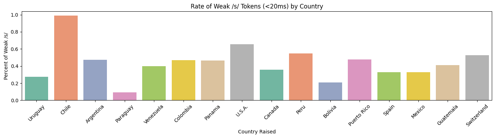

# Fisher Spanish Corpus Parsing + Montreal Forced Alignment Pipeline
Summary (TLDR): This data pipeline automates SPH→WAV conversion, channel splitting, and forced alignment runs to generate TextGrid outputs at scale; added quality control checks to support reliable analysis. This was a final project I designed in my advanced data science linguistics class, where I chose to explore the weakening and dropping in /s/ duration and intensity across various Latin American demographics (ie. Caribbean spanish dialect versus Mexican spanish dialect). 

Language Used: Python3

Overview:
This repository contains scripts to parse the Fisher Spanish corpus, provided by the Linguistic Data Corpus (LDC) of the Univeristy of Pennsylvania. It splits stereo SPH files by channel into per-speaker audio, convert transcripts to per-speaker `.lab` files, and run Montreal Forced Aligner (MFA) to produce TextGrids for downstream phonetic/variationist analysis.

## Corpus
- Source: The Fisher Spanish Corpus (LDC)
- Description of Corpus: Consisted of 864 different 10-12 minute telephone conversations with two speakers per file. 
- Format: Audio files in SPH (SPHERE), speech transcripts as TDF files
- Each conversation has 2 speakers (channel 0 / channel 1) with corresponding subject IDs.
- Speakers analyzed in this study: 91 non-caribbean speakers and 5 caribbean speakers from various different countries
- Total transcripts cover ~163 hours of telephone speech.

**IMPORTANT:** This repo does not distribute Fisher audio/transcripts. You must obtain the corpus from LDC under the appropriate license.

## Pipeline Overview
Input: SPH sound files from your chosen corpus 
Output: TextGrid files for further phonetic/linguistic analysis
1. Split each SPH sound file into two single-channel audio files (speaker 0 and speaker 1 - depending on the number of speakers you have in each sound file) 
2. Convert SPH → WAV
3. Resample WAV to 16 kHz for MFA compatibility
4. Convert TDF transcripts → `.lab`, then split them by channel/speaker 
5. Run Montreal Forced Aligner to generate TextGrids

## Directory Layout
- `data/raw/` place original SPH + TDF here (not tracked by git)
- `data/interim/` intermediate outputs (channel-split audio, per-speaker labs)
- `data/processed/` MFA-aligned outputs (TextGrids, logs)
- `scripts/` processing scripts
- `mfa/` MFA configs, dictionary templates, model notes

## Setup
### Option 1: Conda
```bash
conda env create -f environment.yml
conda activate fisher-align

## Data Analysis Examples

